# Garden Tips

Garden Tips is a site that is targetted towards gardeners - both experienced and less experienced.  Experienced gardeners can post garden tips - including an image, with some context on their location and season to help understand the relevance of the tip.  These can be edited and deleted by the creator.  Less experienced gardeners can provide feedback on the tips, including a score.  This feedback can be edited by the feedback provider.

All tip and feedback content (new and updated) is reviewed by admin before publishing to prevent inappropriate content being published.

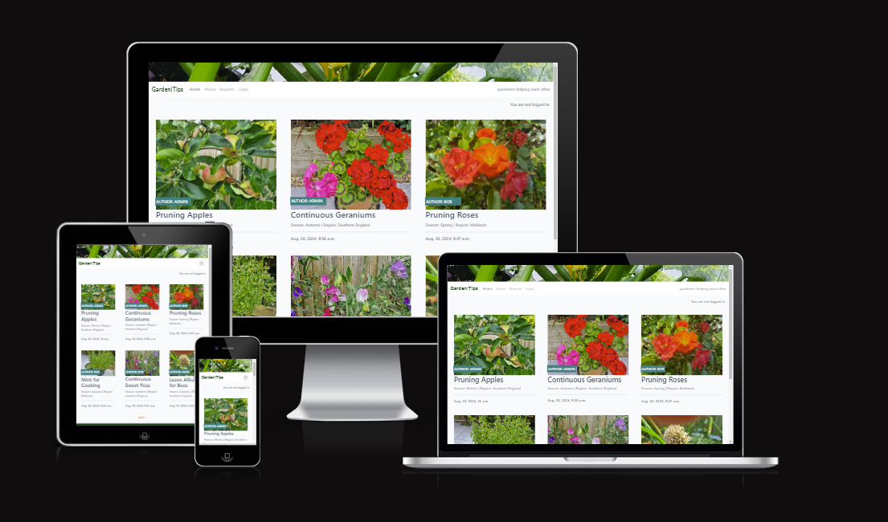

## Index – Table of Contents
* [User Experience (UX)](#user-experience-ux) 
* [Features](#features)
* [Design](#design)
* [Project Management](#project-management)
* [Technologies Used](#technologies-used)
* [Testing](#testing)
* [Deployment](#deployment)
* [Credits](#credits)

## User Experience (UX)

An ideation process was undertaken to suggest and prioritise the user experience for the site.  From this user stories were generated, prioritised (including establishing a Minimum Viable Product) and managed using a Kanban board on GitHub.

-   ### User stories

    -   #### Garden Tips MVP (Minimum Viable Product):
        1. As a **site user**, I can **see the site with clear navigation** so that **I can register for and use the site**.
        2. As a **site user**, I can **register an account** so that **I can submit a Garden Tip or give Feedback on another Garden Tip**.
        3. As a **site user**, I can **click on a Garden Tip** so that **I can read the full text and article detail**.
        4. As a **site user / Admin**, I can **view Feedback in an individual Garden Tip** so that **I can read the conversation**.
        5. As a **site user / Admin**, I can **leave feedback, inlcuding a score on a Garden Tip** so that **I can be involved in the conversation**.
        6. As a **site user / Admin**, I can **modify or delete my feedback on a Garden Tip** so that **I can be involved in the conversation**.
        7. As a **site Admin**, I can **create draft Garden Tips** so that **I can finish writing the content later**.
        8. As a **site user**, I can **create, modify or delete my Garden Tip** so that **I can give a current view**.
        9. As a **site Admin**, I can **approve or disapprove Garden Tips or feedback** so that **I can filter out objectionable comments**.

        #### Garden Tip Enhancements:
        10. As a **site user**, I can **submit gardening questions to Garden Tips** so that **the experts at Garden Tips can use their experience to answer them**.
        11. As a **user who has created Garden Tips**, I can **get a view showing just the garden tips I have submmitted** so that **I can go straight to my tips if I want to edit any or see the comments for any**.
        12. As a **site user**, I can **record my region as part of he registration process** so that **this is then provided to me, each time I create a Garden Tip**.

## Features 

### Features Completed

- __Home Page__
  - The site consists of a landing page with navigation menu at the top, is responsive and allows the user to look at the Garden Tip material submitted by registered users.  To submit (and subsequently edit) material and feedback you have to be a registered user.  On first entering the site the navigation menu includes buttons to Register and Login.  When the user has registered and logged in - these navigation buttons are replaced with one to Create a Garden Tip and on to Logout.  An About link Button is provided which provides an overview of the site and how to use it.

- __Register__

  - Clicking this button provides a Sign Up Screen.  Enter Username and Password (twice for validation) and optionally email.

  
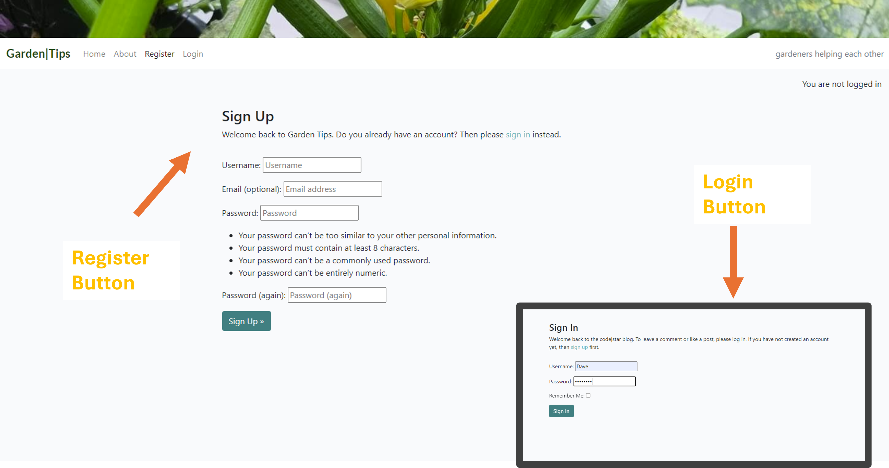

- __Login__

  - After Registering, clicking the Login button provides a login screen to enter Username and password.  The revised Homepage is Now Shown with the Create Tip and Logout Buttons in the top Menu.

- __About__

  - Clicking About - goes to the About Page, giving a Description of the Site and how to use it.

  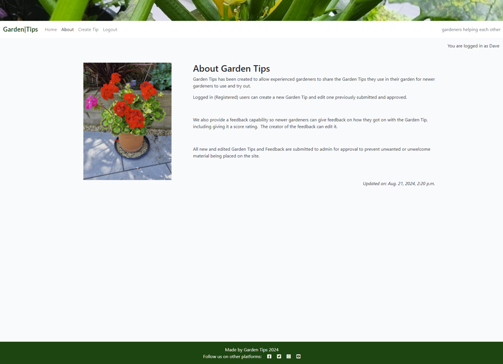

- __Click Garden Tip Item__

  - Clicking the Title of a specific Garden Tip will show that Tip in More Detail.  Including providing the option to submit scored Feedback.

  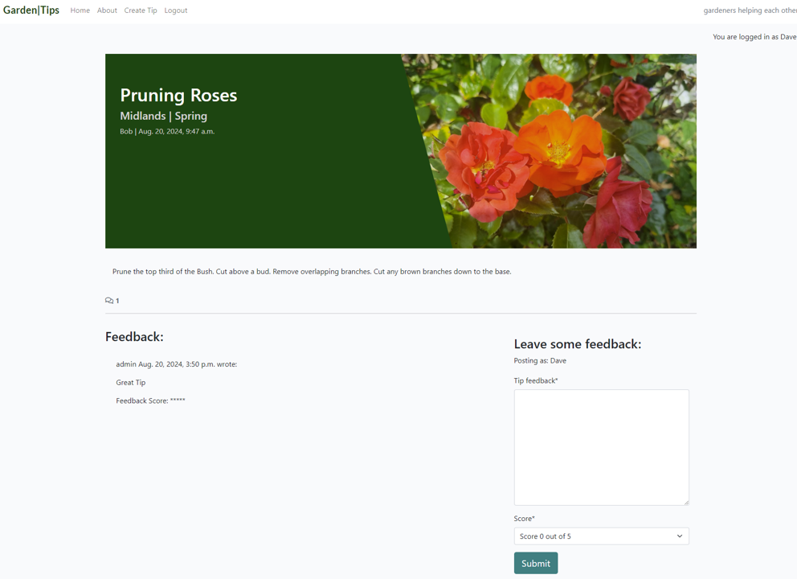

- __Logout__

  - Clicking Logout will provide a screen to enable the user to log out of the system.

- __Leave and Edit Feedback__

  - A logged in user is able to submit feeedback on a tip (not for own Garden Tip), including a score rating.
  - Tips are submitted for approbval By Admin.
  - When Feedback is approved, it is displayed, including the options to Edit or Delete.
  - When editing - the previous comment is placed in the Leave some Feedback box for editing.
  - When the delete buttion is pushed - a check you want to delete form is provided to ensure feedback is not accidently deleted.

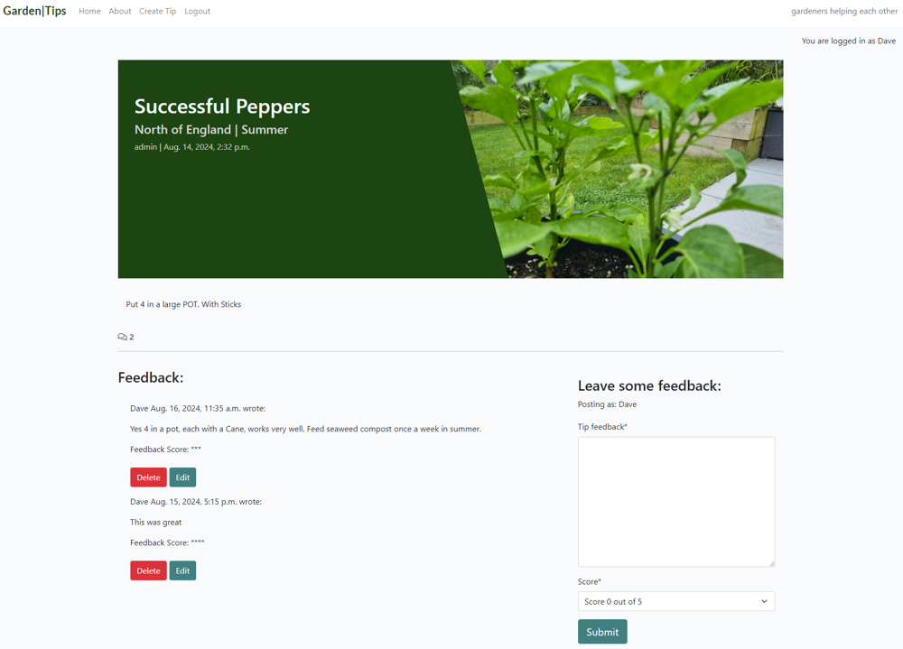

- __Create a Garden Tip__ 

  - After clicking the Create Tip buttion in the top navigation menu - the user is provided with a form to submit their Graden Tip.
  - The Title has to be unique - if it is not unique - a warning message is provided and the user starts again creating the Garden Tip.
  - The Garden Tip is submitted to admin for approval before being shown on the site.

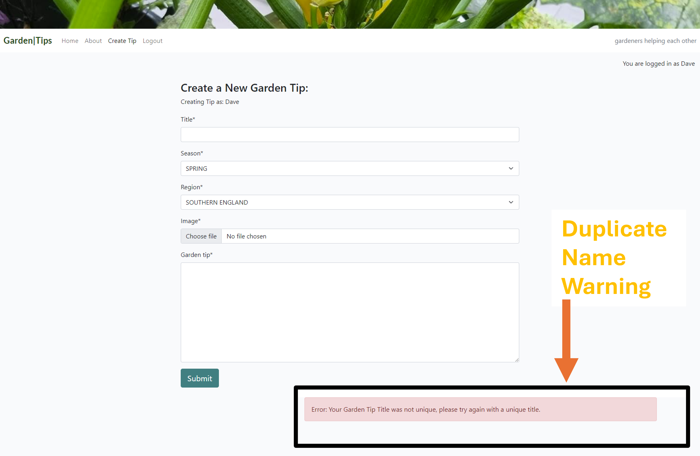

- __Edit a Graden Tip__ 

  - The creator of a Garden Tip is provided with an Edit and Delete button for the tip.
  - After clicking the Edit button, the user is provided with a form, pre-populated with the previously entered info.

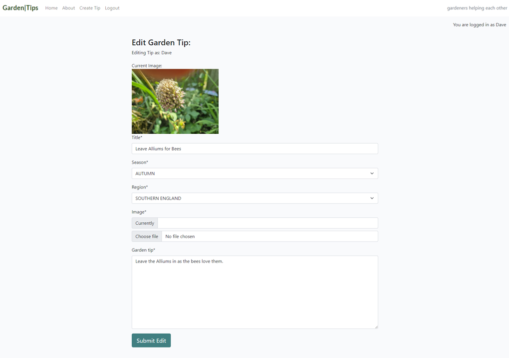

- __Delete A Garden Tip__

  - After clicking the Delete button, the user is provided with a choie of confirming delete, or returning to the Homepage.  To avoid accidental deletion.

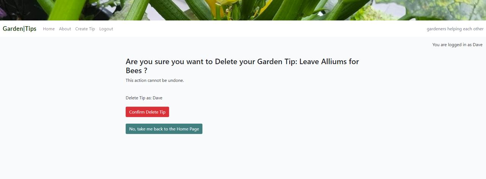

- __Admin Approval of new and edited Feedback and Garden Tips__

  - In the Admin view - a view of both Garden Tips and Feedback is provided.
  - This allows the admin to create draft new or edited Feedback and Garden Tips
  - It also provides a clear view on what is not approved and so guides Admin to the right material to review and approve.

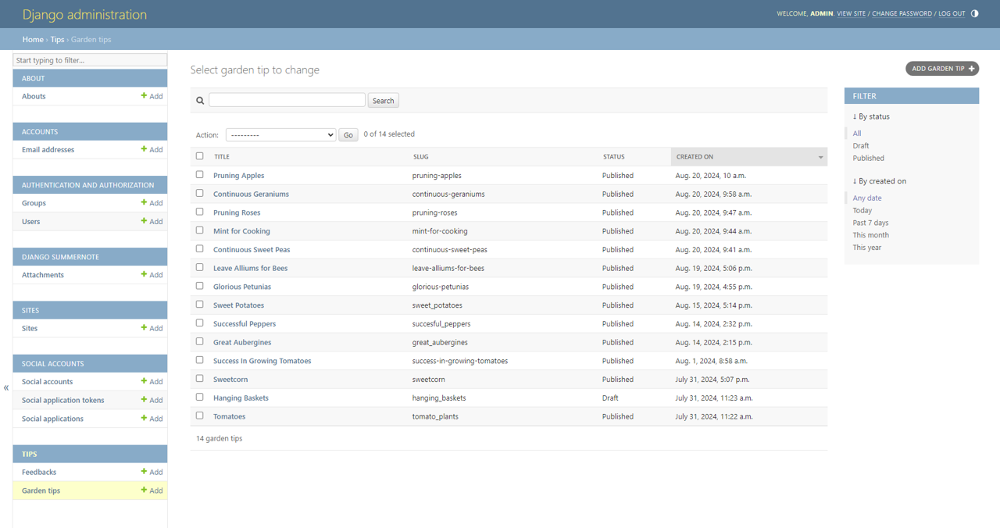

### Features Left to Implement

- Submit Garden Tips: 
	- Add the provision of a form for users to submit questions to the Garden Tips team.
  - Record Email of the requester - so a response Can Be Provided

- Register the users Region
	- Request and record the users Region as part of the registration process.
  - Use this when a user submits a Garden Tip.  And maybe show with the username.
  - Remove from the Create Garden Tip Form and process.

- User Garden Tip View
	- Add a button in the Navigation Menu - Show All Garden Tips
  - Display all the Garden Tips raised by the logged in User.
  - Speed up finding and editing..

## Design

-   ### Two Page Core Site
    -  The core of the site is based on the Home Page, which contains the active Garden Tip infomration for users, an About page which describes the purpose of the site and a detailed individual tip page reached by clicking a specific Garden Tip title.

-   ### Action Screens
    -  Clicking links brings up other views - e.g. User Registration, User Login, Create New Garden Tip, Edit New Garden Tip, Delete Garden Tip, Logout, etc.  On completion of these activites the user is typically returned to the Home page. 

-   ### Colour Scheme
    -  For a Gardening site, Green will be the predominant colour.  Much of this is provided by the images and the feature garden image above the navigation bar.  A "Hunter Green" - #074507 was used to complement this on the site.

    [Hunter Green](https://htmlcolorcodes.com/colors/hunter-green/)
    
-   ### Typography
    - Google Fonts were used to import Roboto and Lato fonts into styles.css.  These look professional but informal for the Garden blog theme.

-   ### Wireframes

    -   #### Site Landing Wireframe

        

    -   #### Weather and Game Wireframe

        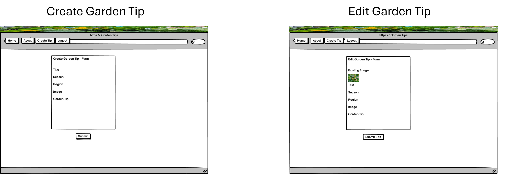

-   ### Database Model Schema
    - Two models have been used.  One for the Garden Tips and One for the Feedback

  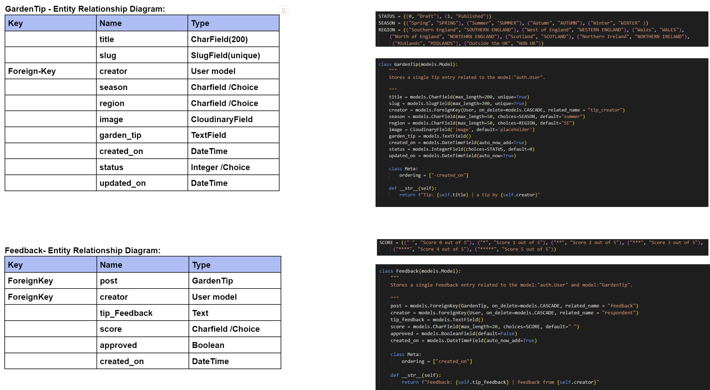   

## Agile Project Management

- An ideation process was undertaken to suggest and prioritise the user experience for the site.  From this user stories were generated, prioritised (including establishing a Minimum Viable Product) and managed using a Kanban board on GitHub.

- Each user story:
  - Included Acceptance Criteria and Tasks.
  - Was tagged with its MoSCoW priority rating.
  - Was regularly managed for completion and moved across the Kanban board.

- User Story - Completed - MVP

 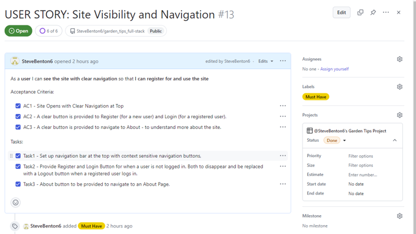

- User Story - Future Feature

 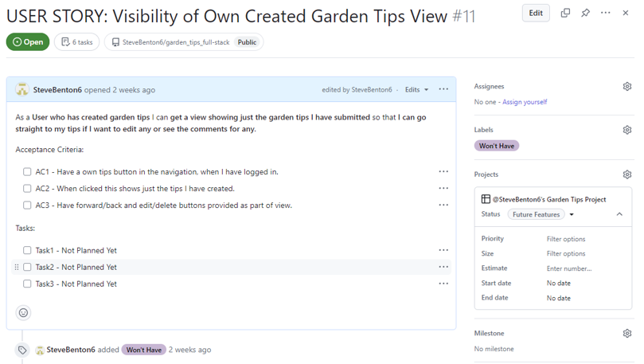

- User Story - Kanban Board

 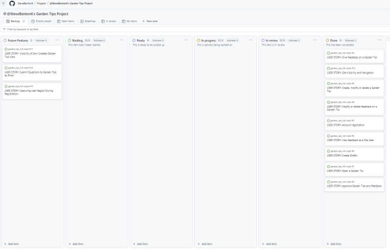   

- The Kanban board was reviewed and updated daily.

  -   #### Kanban Board

      [Link to Kanban Board](https://github.com/users/SteveBenton6/projects/5)

- The MVP Was completed.  The additional items for future development are shown in the Future Features Column.

## Technologies Used

### Languages Used

-   [HTML5](https://en.wikipedia.org/wiki/HTML5)
-   [CSS3](https://en.wikipedia.org/wiki/Cascading_Style_Sheets)
-   [JavaScript](https://en.wikipedia.org/wiki/JavaScript)
-   [Python](https://en.wikipedia.org/Python_(programming_language))

### Frameworks, Libraries & Programs Used

-   [Google Fonts:](https://fonts.google.com/) was used to import the 'Roboto' and 'Lato' fonts into the style.css file which are used across the project site page.
-   [Font Awesome:](https://fontawesome.com/) was used to add icons for aesthetic and UX purposes.
-   [Git:](https://git-scm.com/) was used for version control by utilising the Gitpod terminal to commit to Git and Push to GitHub.
-   [GitHub:](https://github.com/) is used as the respository for the projects code after being pushed from Git.
-   [Balsamiq:](https://balsamiq.com/) was used to create the wireframes during the design process.
-   [bootstrap 5.3:](https://getbootstrap.com/) was the framework used to create a responsive page and the rules modal.
-   [favicon:](https://favicon.io/) was used for creating website page tab icon.
-   [django:](https://www.djangoproject.com/) was the Framework used to build the integrated frontend/backend web application.

  - django applications installed:

     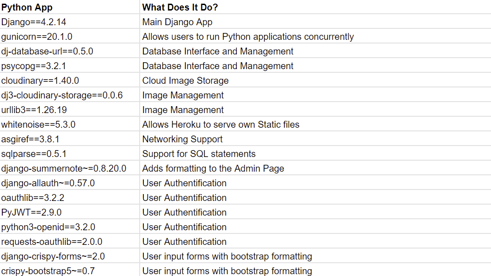

## Testing 

### Validator Testing 

- HTML
  - No errors and 4 warnings were returned when passing through the official [W3C validator](https://validator.w3.org/nu/?doc=https%3A%2F%2Fmarkchips.github.io%2Fprevent-awareness%2Findex.html)
- CSS
  - No errors were found when passing through the official [W3C validator](https://jigsaw.w3.org/css-validator/validator)
- JavaScript
  - No errors and 82 pre ES6 compatability warnings were received using the [JSHint validator](https://jshint.com/)

### Unfixed Bugs

- When a piece of Feedback is edited - the existing Feedback score is not presented in the form (athough cleaerly visible on the page).  This view to be further enhanced to include the urrent feedback score in the edit form.
- The Garden Tip Image Sizes alter the Home Page view.  Additional styling code to be developed to manage the image sizes (and whether Portrait r Landscape) displayed in the Home Page view of Grsening Tips.

## Deployment

- The site was edited in GitPod, with Git used to update the GitHub repository page with the latest version of the code.
- The Project required an SQL database and a Cloudinary account for storage of the project images.  These were set up.
- The project required three environmental settings to work that needed to remain confidential:
  - Secret key to run the application
  - Secret Key to interact with the SQL database
  - Secret Key to interact with the Cloudinary image storage
These 3 keys were stored in an env.py file, which was included in gitignore and so not uploaded to GitBub and so not revealed.

- A Garden Tips project was set up in the Heroku application.
  - The three secret environemntal settings, detailed above, were recorded in Heroku.
  - Heroku was set to use the repository code in GitHub.
  - Before final deployment in Heroku - the settings.py value in the code was set to DEBUG = False (with git used to get this onto GitHub).
  - The project was deployed in Heroku.

The live link can be found here - https://garden-tips-eaf37b541ca8.herokuapp.com/

## Credits 

### Content 

- The project base was influneced by the LMS Blog Project.
- Additional model varianbles, styling, views, urls and HTML were added to provide the full requested CRUD capability.  Garden Tips can be Created, Edited and Deleted with controls in to limit actions to the relevant registered users.  All new and edited Garden Tip and Feedback material goes to admin for approval to ensure no inappropriate material is posted.  The admin views have been enhanced to give admin better visibility on what needs to be reviewed/approved.

### Media

- All media images are my own.
- The fonts used were imported from [Google Fonts](https://fonts.google.com/)